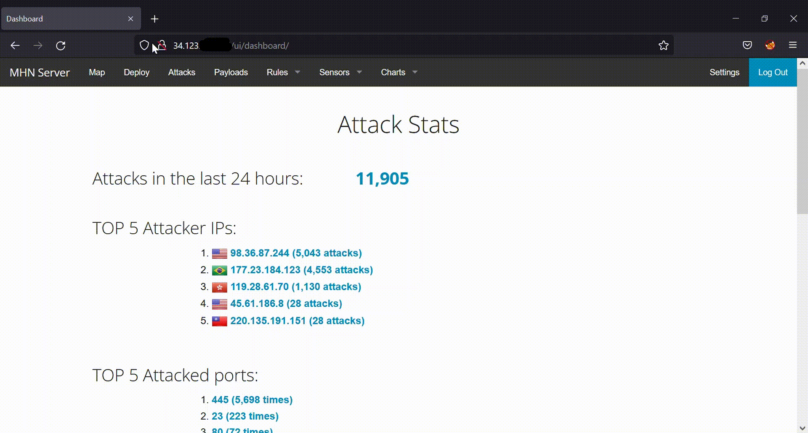
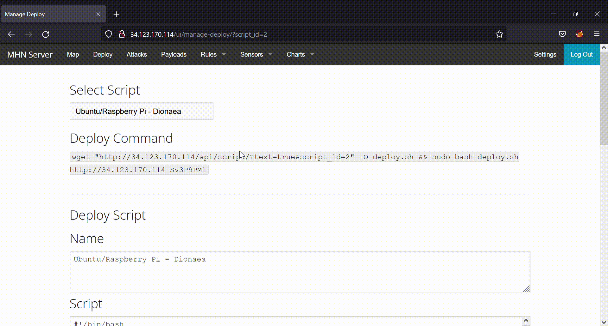

# honeypot

MHN Admin Deployment: 
  For this part, I went to on the MHN admin console on my browser using its IP address. I used 'curl ipinfo.io/ip' to get the IP address of the MHN admin console. Then I clicked on 'Deploy' in the top nav and selected a new script, 'Ubuntu/Raspberry Pi - Dionaea'. 
  
  
  
Dioanaea Honeypot Deployment:
  Once I got the command for the script, I copied and pasted it onto the honeypot VM that I was connected to. There was some issues because there was something updating in the background. But I solved this issue using the following commands: 'ps aux | grep -i apt' and 'sudo kill <process ID>'. The first command gave me a list of activities that was occuring in the background and the second command was used to force those activites to end. Each activity has a unique process ID. 
  
  
  
Database Backup (session.json)
  I copied and pasted 'gcloud compute scp mhn-admin:~/session.json ./session.json' onto my local machine, but there were issues. So I copied and pasted 'gcloud compute scp mhn-admin:/home/<my name>/session.json ./session.json'. 
  
